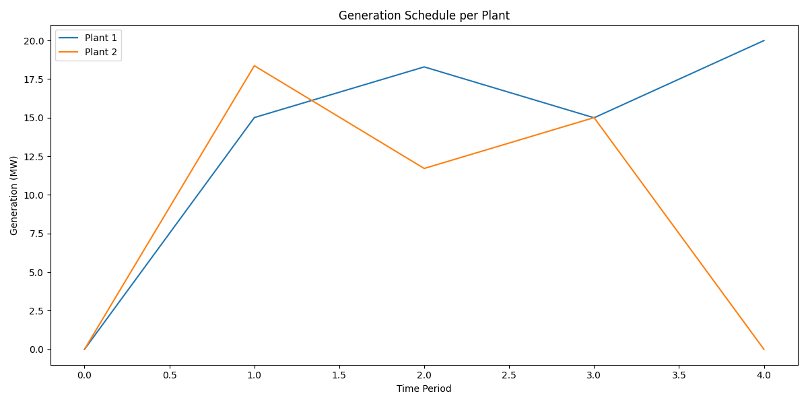

# DFO Energy Optimizer 🔧⚡

This project applies **Derivative-Free Optimization (DFO)** methods such as **Nelder-Mead** and **COBYLA** to solve **energy generation scheduling** problems. The goal is to minimize total operational cost while satisfying constraints like ramp rates, emissions, renewable availability, and demand over time.

---

## 🚀 Features

- ✅ Supports multiple power plant types (Fossil, Nuclear, Renewable)
- ✅ Handles emission limits, fixed/running costs, ramp rate constraints
- ✅ Reads problem data from `.json` files (translated from MiniZinc `.dzn`)
- ✅ Solves using `scipy.optimize.minimize` with Nelder-Mead & COBYLA
- ✅ Visualizes the generation schedule for each plant over time

---

## 📁 Project Structure

```
dfo-energy-optimizer/
├── data/              # JSON datasets (energy scheduling problems)
├── plots/             # Auto-generated plots of schedules
├── data_loader.py     # Loads and validates JSON problem instances
├── main.py            # Solves all data/*.json and saves results/plots
├── optimizer.py       # Defines cost functions and calls scipy.optimize
├── plotting.py        # Plots generation schedule results
└── README.md
```

---

## 📦 Installation

```bash
git clone https://github.com/sacha-is/dfo-energy-optimizer.git
cd dfo-energy-optimizer
pip install -r requirements.txt


---

## 🧠 How to Run

To solve a specific problem (e.g. example1.json) and visualize:
```
python main.py
```
All results will be saved to plots/.


---

## 📊 Example Plot




---

## 📚 Background

Uses Derivative-Free Optimization when derivatives are unavailable or unreliable.
Based on formulations inspired by energy system optimization models from MiniZinc datasets.
Avoids gradient-based methods due to non-smooth penalty-based objective formulation.


---

## 🧑‍🎓 Project Info

This project was developed as part of the Numerical Optimization with Python (Spring 2025) course, with an emphasis on combining algorithmic understanding and real-world applications.
